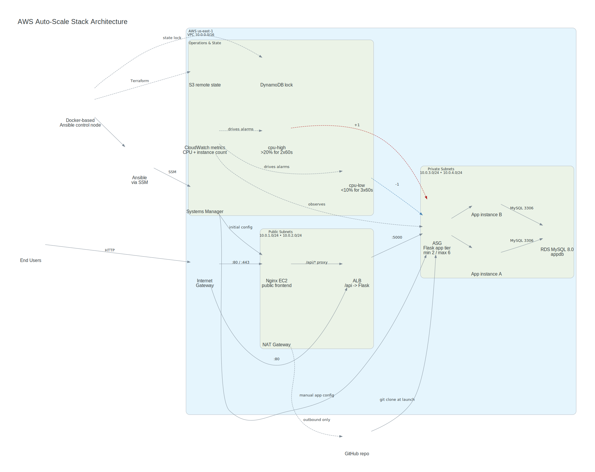

# aws-autoscale-stack

A production-style three-tier application on AWS — provisioned with Terraform, configured with Ansible, and auto-scaling under real load.


---

## What this project demonstrates

- **Infrastructure as Code** — entire AWS stack in four modular Terraform modules; reproducible with a single `terraform apply`
- **Configuration management** — Ansible over AWS SSM (no SSH, no port 22, no bastion) from a Docker-based Linux control node
- **Auto-scaling** — CloudWatch alarm-based simple scaling; Flask tier scales from 2 → 6 instances under CPU load and back to 2 at rest
- **Self-bootstrapping instances** — new ASG instances configure themselves at boot via `user_data` + `ansible-playbook localhost`, no manual intervention needed
- **Least-privilege security** — custom IAM policy, private subnets for app and DB, security group chaining, Ansible Vault for secrets, RDS encryption at rest

---

## Architecture



---

## Stack

| Layer | Technology | Detail |
|---|---|---|
| Cloud | AWS us-east-1 | VPC, ALB, ASG, RDS, SSM, CloudWatch |
| IaC | Terraform 1.6+ | 4 modules · S3 remote state · DynamoDB lock |
| Config | Ansible 2.16+ | Dynamic EC2 inventory · SSM connection · 3 roles |
| App | Flask + gunicorn | 2 workers · systemd unit · `/health` + `/items` |
| DB | RDS MySQL 8.0 | db.t3.micro · gp3 · encrypted · private subnet |
| Scaling | CloudWatch alarms | CPU >20% → +1 · CPU <10% → −1 · 180s cooldown |

---

## Repository layout

```
aws-autoscale-stack/
├── terraform/
│   ├── modules/
│   │   ├── networking/   # VPC, subnets, IGW, NAT, route tables
│   │   ├── alb/          # ALB, listener, target group
│   │   ├── asg/          # Launch template, ASG, scaling policies, CloudWatch alarms
│   │   └── database/     # RDS MySQL, subnet group, security group
│   └── ...
├── ansible/
│   ├── roles/
│   │   ├── frontend/     # Nginx + reverse proxy config
│   │   ├── app/          # Flask + gunicorn + systemd unit
│   │   └── db_init/      # MySQL seed (idempotent)
│   ├── Dockerfile.ansible
│   └── with-docker-ansible.sh
├── scripts/
│   ├── load_test.py      # 200-worker HTTP load generator
│   └── collect_evidence.sh
└── docs/
    ├── architecture.md   # Full architecture doc + diagrams + evidence
    ├── reflection.md     # Design decisions + lessons learned
    ├── learnings.md      # Troubleshooting journal
    └── iam-policy.json   # Least-privilege IAM policy
```

---

## Quick start

**Prerequisites:** Terraform ≥ 1.6, AWS CLI ≥ 2, Docker

```bash
# 1 — provision infrastructure
cd terraform
cp terraform.tfvars.example terraform.tfvars   # fill in db credentials
terraform init && terraform apply
terraform output -json > ../ansible/inventory/tf_outputs.json

# 2 — configure instances (Docker required on macOS)
cd ../ansible
docker build -f Dockerfile.ansible -t capstone-ansible:ssm .
./with-docker-ansible.sh ansible-playbook site.yml --ask-vault-pass

# 3 — verify
curl http://<alb_dns_name>/health   # → {"status":"ok"}
curl http://<alb_dns_name>/items    # → JSON list from RDS

# 4 — tear down (saves ~$3.10/day)
cd ../terraform && terraform destroy
```

> **Note:** Ansible must run via the Docker wrapper on macOS. The `amazon.aws.aws_ssm` connection plugin hangs indefinitely on macOS — see [docs/learnings.md](docs/learnings.md) for the root cause.

---

## Docs

| Document | What's in it |
|---|---|
| [docs/architecture.md](docs/architecture.md) | Full architecture diagrams, Terraform module breakdown, Ansible roles, scaling policy, load test results + all screenshots |
| [docs/reflection.md](docs/reflection.md) | Challenges, design decisions, IaC consistency, lessons learned |
| [docs/learnings.md](docs/learnings.md) | Detailed troubleshooting journal — 14 discoveries from root cause to fix |
| [docs/iam-policy.json](docs/iam-policy.json) | Least-privilege IAM policy for the deployment user |
