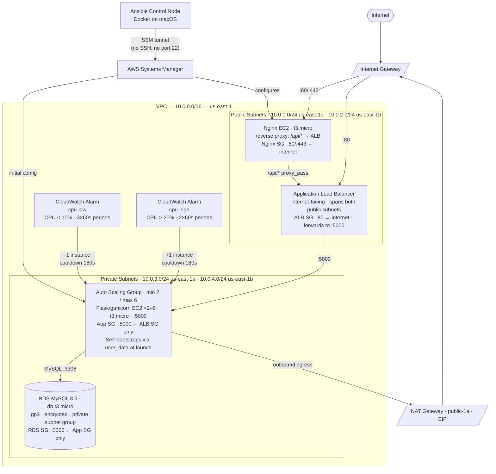
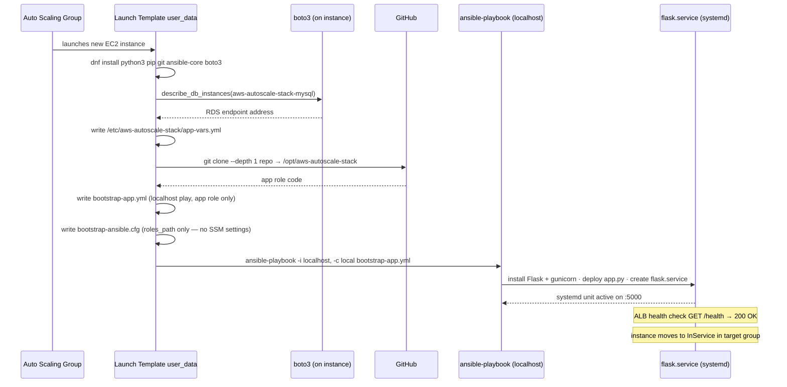
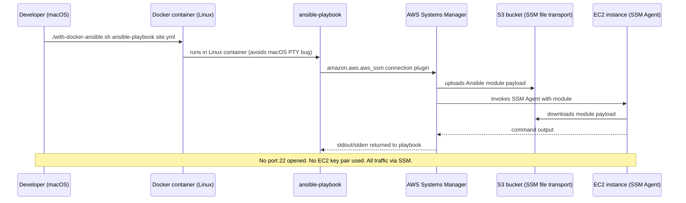

# Architecture — aws-autoscale-stack

## Overview

Multi-tier web application deployed on AWS with auto-scaling, managed entirely through Terraform (infrastructure provisioning) and Ansible (configuration management). The stack runs a three-tier application: Nginx reverse proxy → Flask/gunicorn application tier (Auto Scaling Group) → RDS MySQL database. Infrastructure scales automatically via CloudWatch alarm-based simple scaling policies.

---


*Figure 1. Final deployed architecture showing the AWS network layout, runtime traffic path, management path, and alarm-based scaling control flow.*

---

## Architecture Diagram



---

## Scale-Out Bootstrap Flow

When the ASG launches a new instance due to a scale-out event, the instance configures itself automatically via the launch template `user_data` script — no manual Ansible run required.



---

## Ansible Control-Node Flow

Initial configuration of all instances (and ongoing management) uses Ansible running inside a Linux Docker container on the macOS development machine, connecting via AWS Systems Manager. No SSH, no port 22, no EC2 key pairs.



---

## Component Inventory

| Component | Terraform Resource | Details |
|-----------|-------------------|---------|
| VPC | `aws_vpc` | `10.0.0.0/16`, DNS hostnames and DNS support enabled |
| Public subnet — us-east-1a | `aws_subnet` | `10.0.1.0/24` — Nginx EC2, NAT Gateway |
| Public subnet — us-east-1b | `aws_subnet` | `10.0.2.0/24` — ALB node |
| Private subnet — us-east-1a | `aws_subnet` | `10.0.3.0/24` — ASG Flask instances |
| Private subnet — us-east-1b | `aws_subnet` | `10.0.4.0/24` — ASG Flask instances, RDS |
| Internet Gateway | `aws_internet_gateway` | Public subnet egress to internet |
| Elastic IP | `aws_eip` | Static IP for NAT Gateway |
| NAT Gateway | `aws_nat_gateway` | Private subnet outbound egress; located in public-1a |
| Route table — public | `aws_route_table` | `0.0.0.0/0` → Internet Gateway |
| Route table — private | `aws_route_table` | `0.0.0.0/0` → NAT Gateway |
| ALB | `aws_lb` | Internet-facing; spans both public subnets |
| ALB Target Group | `aws_lb_target_group` | Port 5000, HTTP; health check `GET /health → 200` |
| ALB Listener | `aws_lb_listener` | Port 80 → forward to target group |
| Launch Template | `aws_launch_template` | Pinned AL2023 AMI, t3.micro; user_data self-bootstrap script |
| Auto Scaling Group | `aws_autoscaling_group` | min 2 / desired 2 / max 6; private subnets; ELB health check; 300s grace |
| Scale-out policy | `aws_autoscaling_policy` | SimpleScaling; +1 instance; cooldown 180s |
| Scale-in policy | `aws_autoscaling_policy` | SimpleScaling; -1 instance; cooldown 180s |
| CPU-high alarm | `aws_cloudwatch_metric_alarm` | `AWS/EC2 CPUUtilization > 20%` with `AutoScalingGroupName` dimension; 2 × 60s periods → triggers scale-out |
| CPU-low alarm | `aws_cloudwatch_metric_alarm` | `AWS/EC2 CPUUtilization < 10%` with `AutoScalingGroupName` dimension; 3 × 60s periods → triggers scale-in |
| Nginx EC2 | `aws_instance` | t3.micro; public-1a; public IP; reverse proxy |
| EC2 IAM Role | `aws_iam_role` | `AmazonSSMManagedInstanceCore` + S3 transport + `rds:DescribeDBInstances` |
| EC2 Instance Profile | `aws_iam_instance_profile` | Attaches IAM role to EC2 instances |
| RDS MySQL | `aws_db_instance` | MySQL 8.0; db.t3.micro; gp3; `storage_encrypted = true`; `publicly_accessible = false` |
| DB Subnet Group | `aws_db_subnet_group` | Both private subnets |
| Terraform State | S3 + DynamoDB | `aws-autoscale-stack-tf-state-amogh`; server-side encryption; state lock |

---

## Terraform Modules

The infrastructure is organised into four child modules, each with a single responsibility. The root module (`terraform/main.tf`) wires them together, passing outputs from one module as inputs to the next.

### `modules/networking/` — VPC and Network Topology

Provisions all Layer 3 networking resources.

**Resources created (14 total):**
- `aws_vpc` — the network boundary; CIDR `10.0.0.0/16`; DNS hostnames enabled so EC2 instances receive resolvable hostnames
- `aws_subnet` ×4 — two public (`10.0.1.0/24`, `10.0.2.0/24`) and two private (`10.0.3.0/24`, `10.0.4.0/24`) across two Availability Zones for high availability
- `aws_internet_gateway` — attaches to the VPC; provides internet access for public subnets
- `aws_eip` + `aws_nat_gateway` — the NAT Gateway sits in public-1a and gives private subnet instances outbound internet access (for package installs, git clone, SSM endpoints) without exposing inbound ports
- `aws_route_table` ×2 — one routes public subnets to the IGW; one routes private subnets to the NAT Gateway
- `aws_route_table_association` ×4 — associates each subnet with the correct route table

**Outputs:** `vpc_id`, `public_subnet_ids`, `private_subnet_ids`

---

### `modules/alb/` — Application Load Balancer

Provisions the internet-facing load balancer that distributes HTTP traffic across Flask instances.

**Resources created (4 total):**
- `aws_security_group` (`alb-sg`) — inbound port 80 from `0.0.0.0/0`; all outbound
- `aws_lb` — internet-facing ALB spanning both public subnets; handles connection termination and health-based routing
- `aws_lb_target_group` — port 5000, HTTP protocol; health check `GET /health` expects `200`; health check runs independently of the database so a healthy Flask process is declared healthy even if RDS is unreachable
- `aws_lb_listener` — listens on port 80; forwards all requests to the target group

**Design note:** The target group health check hits `/health` (not `/items`). This decouples load balancer liveness from database state — the ALB can mark an instance healthy as soon as Flask is running, without waiting for a successful DB query.

**Outputs:** `alb_dns_name`, `alb_target_group_arn`, `alb_sg_id`

---

### `modules/asg/` — Auto Scaling Group, Flask Instances, and Nginx

The largest module. Provisions the application compute tier, the Nginx reverse proxy, and the auto-scaling control plane.

**Resources created (10 total):**
- `aws_security_group` (`app-sg`) — inbound port 5000 from `alb-sg` **security group ID** only (not a CIDR); no port 22; this ensures Flask instances are reachable only via the ALB, and new ASG instances automatically inherit this permission at launch
- `aws_security_group` (`nginx-sg`) — inbound ports 80 and 443 from `0.0.0.0/0`; no port 22
- `aws_iam_role` + `aws_iam_instance_profile` — grants EC2 instances `AmazonSSMManagedInstanceCore` (SSM management), S3 read/write (SSM file transport), and `rds:DescribeDBInstances` (bootstrap endpoint lookup)
- `aws_launch_template` — pinned AL2023 AMI; t3.micro; instance profile attached; `user_data` self-bootstrap script (installs tools, queries RDS endpoint via boto3, clones repo, writes local bootstrap playbook, runs `ansible-playbook localhost`)
- `aws_autoscaling_group` — min 2 / desired 2 / max 6; deploys into both private subnets; ELB health check type (ALB target group health drives ASG replacement decisions); 300s health check grace period to allow bootstrap to complete
- `aws_autoscaling_policy` ×2 — one `SimpleScaling` policy for scale-out (+1 instance, cooldown 180s) and one for scale-in (-1 instance, cooldown 180s)
- `aws_cloudwatch_metric_alarm` ×2 — `cpu-high` alarm (CPU > 20% for 2 × 60s → triggers scale-out policy); `cpu-low` alarm (CPU < 10% for 3 × 60s → triggers scale-in policy)
- `aws_instance` (Nginx) — t3.micro in public-1a; public IP assigned; reverse proxies `/api/*` to the ALB DNS name

**Outputs:** `asg_name`, `app_sg_id`, `nginx_public_ip`

---

### `modules/database/` — RDS MySQL

Provisions the managed relational database and its network isolation.

**Resources created (3 total):**
- `aws_security_group` (`rds-sg`) — inbound port 3306 from `app-sg` **security group ID** only; receives `vpc_id` as an explicit variable (not a data source lookup, which would be fragile if multiple VPCs exist)
- `aws_db_subnet_group` — spans both private subnets so RDS can be placed in either AZ
- `aws_db_instance` — MySQL 8.0; db.t3.micro; database name `appdb` (MySQL does not allow hyphens in database names); gp3 storage; `storage_encrypted = true`; `skip_final_snapshot = true` (capstone environment); `publicly_accessible = false`

**Outputs:** `db_endpoint`, `db_name`

---

## Ansible Roles

Configuration is applied by three Ansible roles, executed by the `site.yml` master playbook from a Docker-based control node using SSM for connectivity. New ASG instances reuse the `app` role locally at boot via the self-bootstrap mechanism.

### `roles/frontend` — Nginx Reverse Proxy

**Applied to:** `role_nginx` group (the Nginx EC2 instance)

| Task | Detail |
|------|--------|
| Install Nginx | `ansible.builtin.dnf` on Amazon Linux 2023 |
| Template `nginx.conf.j2` | Reverse proxy: `/api/*` → `http://{{ alb_dns_name }}/`; includes `proxy_set_header`, timeouts, and upstream keepalive |
| Template `index.html.j2` | Simple web page that fetches `/api/items`; includes HTTP error handling |
| Enable + start Nginx | systemd; handler **reloads** (not restarts) on config change to avoid dropping connections |

---

### `roles/app` — Flask Application Server

**Applied to:** `role_app` group via SSM (initial setup); `localhost` via bootstrap script (scale-out)

| Task | Detail |
|------|--------|
| Install dependencies | `python3`, `pip`, `flask`, `mysql-connector-python`, `gunicorn` via `dnf` |
| Deploy `app.py` | Templated from `app.py.j2`; two endpoints: `GET /health` (returns `{"status":"ok"}`), `GET /items` (queries RDS MySQL) |
| Create systemd unit | Templated from `flask.service.j2`; invokes `python3 -m gunicorn` (path-agnostic on AL2023) with 2 workers, bound to `0.0.0.0:5000` |
| Enable + start service | `daemon-reload` → `enable` → `start`; handler restarts on app change |

**Design note:** `gunicorn` is invoked as `python3 -m gunicorn` rather than a direct binary path. On Amazon Linux 2023, `which gunicorn` does not reliably return a consistent path after a pip install into the system Python. The module invocation is path-agnostic and works regardless of installation location.

---

### `roles/db_init` — Database Seeding

**Applied to:** `role_app` group; `run_once: true` in `site.yml` (runs on exactly one app instance)

| Task | Detail |
|------|--------|
| Install mariadb client | `mariadb105` package via `dnf` (Amazon Linux 2023 does not have the `mysql` client package) |
| Copy `seed.sql` | Transfers SQL file to the instance |
| Run seed | `shell` module (not `command` — shell redirection `<` required for stdin); runs `mysql < seed.sql` against RDS |

**Idempotency:** `seed.sql` uses `CREATE TABLE IF NOT EXISTS items (name VARCHAR(255) UNIQUE)` and `INSERT IGNORE` — safe to re-run at any time without duplicating data. DB seeding is intentionally kept out of the scale-out bootstrap path; only the `app` role runs on new instances.

---

## Traffic Flow

### User Request Path

```
Browser
  → Nginx EC2 (:80)
      → /api/* proxy_pass → ALB (:80)
          → ALB forwards to Flask EC2 (:5000)
              → Flask queries RDS MySQL (:3306)
                  → JSON response returned upstream
```

### Management Path (Ansible via SSM)

```
Developer (macOS)
  → Docker container (Linux — avoids macOS PTY bug in aws_ssm plugin)
      → Ansible (amazon.aws.aws_ssm connection plugin)
          → AWS Systems Manager
              → S3 bucket (module file transport)
              → EC2 SSM Agent
```

No SSH. No port 22. No EC2 key pairs anywhere in the stack.

### Scale-Out Path (Self-Bootstrap)

```
CloudWatch cpu-high alarm (CPU > 20%, 2×60s)
  → ASG scale-out policy (+1 instance, cooldown 180s)
      → New EC2 launched from latest Launch Template version
          → user_data: install tools → boto3 RDS endpoint lookup → git clone repo
              → write bootstrap-app.yml + bootstrap-ansible.cfg (localhost only, no SSM)
                  → ansible-playbook -i localhost, -c local → app role
                      → Flask + gunicorn + flask.service running on :5000
                          → ALB health check GET /health → 200 OK → instance InService
```

---

## Security Groups

| Security Group | Inbound Rule | Source | Purpose |
|----------------|-------------|--------|---------|
| `alb-sg` | TCP :80 | `0.0.0.0/0` | Internet-facing ALB |
| `nginx-sg` | TCP :80, :443 | `0.0.0.0/0` | Public Nginx reverse proxy |
| `app-sg` | TCP :5000 | `alb-sg` (SG reference) | Flask instances — reachable from ALB only, not internet |
| `rds-sg` | TCP :3306 | `app-sg` (SG reference) | RDS — reachable from Flask instances only |

**Security group chaining:** `app-sg` and `rds-sg` reference other security groups as sources rather than CIDR blocks. This means any new EC2 instance the ASG launches is automatically permitted to reach RDS the moment it is associated with `app-sg` — no manual rule updates needed as instances scale in and out.

---

## Scaling Policy

| Parameter | Value |
|-----------|-------|
| Policy type | Simple Scaling (alarm-based) |
| Scale-out trigger | `AWS/EC2 CPUUtilization > 20%` with `AutoScalingGroupName` dimension for 2 consecutive 60-second periods |
| Scale-in trigger | `AWS/EC2 CPUUtilization < 10%` with `AutoScalingGroupName` dimension for 3 consecutive 60-second periods |
| Scale-out action | +1 instance |
| Scale-in action | −1 instance |
| Cooldown (both policies) | 180 seconds |
| Minimum instances | 2 |
| Maximum instances | 6 |
| Health check type | ELB — ALB target group health drives ASG replacement decisions |
| Health check grace period | 300 seconds — allows user_data bootstrap (~2–3 min) to complete before the first health check |

**Thresholds are based on observed metrics.** During load testing, the app tier consistently exceeded 20% average CPU under sustained concurrent requests. After load stopped, CPU dropped below 10% within one to two minutes. The 20%/10% split prevents oscillation at the boundary.

> **Note:** Target tracking at 25% CPU was the original design. It was changed to explicit alarm-based simple scaling during implementation so that each scale event is a discrete, named CloudWatch alarm state transition — observable in the console as +1 or −1 steps rather than a potentially large capacity jump. For a production workload with unpredictable traffic patterns, target tracking is the better default. See `reflection.md` for the full decision narrative.

---

## Security Design

| Concern | Approach |
|---------|----------|
| No public SSH | Port 22 not open on any security group |
| No EC2 key pairs | Removed from Terraform entirely — unnecessary with SSM |
| Least-privilege IAM | Custom `aws-autoscale-stack-policy` (not `AdministratorAccess`); iterated to minimum required permissions |
| Instance access | SSM Session Manager only — audited via CloudTrail; no open inbound ports |
| Secrets at rest | `ansible-vault` AES-256 encrypts `vault.yml` containing the DB password |
| RDS encryption | `storage_encrypted = true`; gp3 storage |
| State encryption | S3 backend with `encrypt = true`; DynamoDB table for state locking |
| Network isolation | Flask instances in private subnets — no route from internet, no public IP |
| RDS isolation | `publicly_accessible = false`; security group allows :3306 only from `app-sg` |
| ALB isolation | Security group allows :80 only from internet; Flask instances only reachable from ALB SG |
| RDS endpoint discovery | EC2 IAM role includes `rds:DescribeDBInstances`; instances query their own RDS endpoint at boot via boto3 — no hardcoded hostname in the AMI or launch template |
| AMI pinning | Specific AL2023 AMI IDs pinned in `terraform.tfvars` after a validated deployment; prevents `terraform plan` from detecting AMI drift and proposing unexpected instance replacements on subsequent runs |

---

## Load Test and Scaling Evidence

The following results were captured on 2026-04-14 using the `scripts/load_test.py` and `scripts/collect_evidence.sh` tools against the live stack in us-east-1. Two separate load test runs were performed — one against the earlier target-tracking configuration, and one against the final alarm-based simple scaling configuration.

---

### Load Test Parameters

| Parameter | Value |
|-----------|-------|
| Target URL | `http://aws-autoscale-stack-alb-1462701993.us-east-1.elb.amazonaws.com/items` |
| Concurrent workers | 200 |
| Duration | 600 seconds (10 minutes) |
| Per-request timeout | 5 seconds |
| Elapsed (actual) | 602.4 seconds |

---

### Load Test Results

| Metric | Value |
|--------|-------|
| Total requests sent | 119,430 |
| Successful (HTTP 200) | 119,401 |
| Errors (URLError / timeout) | 29 |
| **Error rate** | **0.024%** |
| **Throughput** | **~198 requests/second** |
| Latency — minimum | 66.9 ms |
| Latency — average | 1,006.6 ms |
| Latency — p95 | 2,577 ms |
| Latency — p99 | 2,920 ms |
| Latency — maximum | 4,489 ms |

**Interpretation:** Under 200 concurrent workers over 10 minutes, the stack handled 119,430 requests with a 99.976% success rate. The 29 errors were all connection timeouts (`URLError`), not application errors — consistent with occasional requests hitting instances that were mid-bootstrap during a scale-out event. Average latency of ~1 second reflects the round trip from macOS → ALB → Flask → RDS MySQL → response, acceptable for a database-backed API endpoint serving live MySQL queries on t3.micro instances. The p95/p99 latency spike (2.6–2.9 s) is consistent with RDS connection pooling pressure under peak concurrent load. No HTTP 5xx errors were returned by the application.

---

### Scaling Event Timeline — Run 1 (Target Tracking, 2026-04-14 ~13:04–13:31 UTC)

This run demonstrated the earlier target-tracking configuration. The alarm triggered a large multi-instance jump on first fire.

| Time (UTC) | Event | Instance Count |
|------------|-------|---------------|
| 13:04:57 | `cpu-high` alarm ALARM state — earlier target tracking policy fired | 2 → 5 (+3 simultaneously) |
| 13:05:10 | 3 new instances starting | 5 launching |
| 13:06:57 | `cpu-high` alarm fired again (sustained load) | 5 → 6 (+1) |
| 13:07:09 | 6th instance started — **peak capacity reached** | **6 instances** |
| 13:26:41 | `cpu-low` alarm ALARM state — scale-in begins | 6 → 5 (−1) |
| 13:27:41 | Scale-in continues | 5 → 4 (−1) |
| 13:29:10 | Scale-in continues | 4 → 3 (−1) |
| 13:31:20 | Scale-in complete — back to baseline | 3 → 2 (−1) |

**Observation:** Target tracking scaled out aggressively — jumping from 2 to 5 in a single action. Scale-in was gradual and stepped. Total scale-in time: ~5 minutes (13:26 → 13:31). All 6 scaling activities completed with status `Successful`.

---

### Scaling Event Timeline — Run 2 (Alarm-Based Simple Scaling, 2026-04-14 ~14:35–14:54 UTC)

This run demonstrated the final alarm-based configuration. Scale-out stepped +1 at a time with the 180s cooldown clearly visible between events (~4 minutes per step).

| Time (UTC) | Event | Instance Count |
|------------|-------|---------------|
| 14:35:20 | `aws-autoscale-stack-cpu-high` ALARM → scale-out policy fires | 2 → 3 (+1) |
| 14:35:31 | New instance starting | 3 launching |
| 14:39:20 | `cpu-high` alarm fires again (cooldown elapsed) | 3 → 4 (+1) |
| 14:39:22 | Instance started | 4 in service |
| 14:43:20 | `cpu-high` alarm fires (cooldown elapsed) | 4 → 5 (+1) |
| 14:43:35 | Instance started — **peak capacity** | **5 instances** |
| 14:45:00 | CloudWatch: ASG avg CPU 1.91%, max 43.14% (peak load window) | — |
| 14:49:57 | `aws-autoscale-stack-cpu-low` ALARM → scale-in policy fires | 5 → 4 (−1) |
| 14:50:01 | Instance entering `WaitingForELBConnectionDraining` | 4 + 1 draining |
| 14:50:00 | CloudWatch: ASG avg CPU 0.20% (load stopped) | — |
| 14:53:57 | `cpu-low` fires again (cooldown elapsed) | 4 → 3 (−1) |
| 14:54:03 | Instance draining | 3 + 1 draining |

**Observation:** Alarm-based simple scaling produced clear, observable +1 steps separated by the 180s cooldown. Each scale-out event was identifiable as a distinct CloudWatch alarm state transition. Scale-in correctly entered `WaitingForELBConnectionDraining` before termination, ensuring in-flight requests completed. The 4-minute gap between scale steps (alarm cooldown + instance warmup + next metric evaluation) is intentional and expected.

---

### CloudWatch Metrics Captured

| Timestamp (UTC) | ASG Avg CPU | ASG Max CPU | Interpretation |
|-----------------|-------------|-------------|----------------|
| 14:45 | 1.91% | 43.14% | Peak load window — one instance saturated, average pulled down by other healthy instances |
| 14:50 | 0.20% | 0.29% | Load stopped — CPU near-idle across all instances |
| 14:30 | 0.20% | 0.26% | Post-load, steady state — 2 instances, idle |

The max CPU of 43.14% on a single instance during peak (14:45) confirms that load was not evenly distributed — ALB weighted requests toward available instances while new instances were still bootstrapping.

---

### Screenshots

All screenshots were captured from the AWS Console and terminal during the live deployment and load tests. They are organised in chronological order across four phases: Ansible deployment, baseline state, scale-out under load, and scale-in after load.

---

#### Phase A — Ansible Deployment (2026-04-13)

**Ansible connectivity test — all instances respond via SSM**


*`./with-docker-ansible.sh ansible all -m ansible.builtin.ping --ask-vault-pass -f 1` — all EC2 instances return `"ping": "pong"` with `SUCCESS` status. Confirms SSM connectivity through the Docker-based Ansible control node before running the full playbook.*

---

**Ansible full playbook run — `site.yml` completes successfully**


*`./with-docker-ansible.sh ansible-playbook site.yml --ask-vault-pass` completing all three plays: `frontend` (Nginx deploy + enable), `app` (Python3/Flask/gunicorn install, app.py deploy, flask.service create + start), and `db_init` (mariadb client install, seed.sql copy + run). PLAY RECAP shows `ok` and `changed` tasks, zero failures across both app instances.*

---

#### Phase B — Baseline State (2026-04-14, pre-load-test)

**ASG instance management — 2 instances at baseline**


*Auto Scaling Group `aws-autoscale-stack-asg` showing desired = 2, both instances `InService` and `Healthy`, t3.micro. This is the steady-state before any load is applied.*

---

**ALB target group — 2 healthy registered targets**


*ALB target group showing both Flask instances registered on port 5000 with `Healthy` status — one in `us-east-1a`, one in `us-east-1b`. This confirms the ALB health check (`GET /health → 200`) is passing on both instances before load is applied.*

---

**CloudWatch CPU — flat baseline, spike beginning**


*CloudWatch `CPUUtilization` for the ASG (UTC timezone, 1-minute average). CPU is flat near 0% from 13:35–14:20 UTC, then a sharp spike to ~25% appears at 14:25 as the 200-worker load test starts.*

---

**CloudWatch cpu-high alarm — OK state (load not yet sustained)**


*`aws-autoscale-stack-cpu-high` alarm in `OK` state. The red dashed threshold line (CPU > 20% for 2 datapoints) is visible but not yet crossed. CPU is at 0.18% at this point. Both alarms (`cpu-high`, `cpu-low`) are OK.*

---

#### Phase C — Scale-Out Under Load

**CloudWatch cpu-high alarm — In Alarm (scale-out triggered)**


*`aws-autoscale-stack-cpu-high` alarm transitions to `In Alarm` state — CPU has exceeded 20% for 2 consecutive 60-second periods. The alarm is now triggering the `aws-autoscale-stack-scale-out` policy. The alarm bar at the bottom turns red. `cpu-low` remains OK.*

---

**CloudWatch cpu-high alarm — sustained at peak (CPU 65.8%)**


*CPU climbs to 65.8% under 200 concurrent workers — well above the 20% threshold. The alarm remains `In Alarm`, continuing to trigger scale-out events (one new instance per 180s cooldown). This is the peak load window.*

---

**ASG instances — 4 instances InService (mid scale-out)**


*ASG instance list showing 4 Flask instances all `InService` and `Healthy` across `us-east-1a` and `us-east-1b`. The ASG has scaled from 2 → 3 → 4 via two consecutive alarm triggers with 180s cooldown between each.*

---

**ASG instances — 5 instances InService (peak capacity)**


*All 5 Flask instances `InService` and `Healthy` — the maximum reached during Run 2. Instances are distributed across both Availability Zones. A third `cpu-high` alarm trigger scaled the ASG from 4 → 5.*

---

#### Phase D — Scale-In After Load Stops

**CloudWatch cpu-low alarm — In Alarm (scale-in triggered)**


*`aws-autoscale-stack-cpu-low` alarm transitions to `In Alarm` — CPU has dropped below 10% for 3 consecutive 60-second periods after the load test stopped. Peak CPU of 59.3% is visible at 10:35 local, then drops sharply. The alarm triggers the `aws-autoscale-stack-scale-in` policy.*

---

**CloudWatch CPU arc — full scale-out and scale-in cycle**


*Complete CPU arc in UTC timezone: CPU climbs from near 0% → peaks at ~59.3% at 14:25 UTC → drops to 37.5% at 14:40 UTC as new instances absorb load → drops to near 0% as load stops. The entire scale-out/in cycle is visible in a single graph.*

---

**CloudWatch cpu-low alarm — full CPU cycle view**


*`cpu-low` alarm graph showing the full spike-and-decline arc. The red dashed threshold line at 10% is clearly visible below the peak. The alarm status bar shows: red (In Alarm) → green (OK) → red (In Alarm again) — matching the scale-out and scale-in sequence.*

---

**ASG instances — 4 Healthy + 1 Terminating (scale-in step 1)**


*First scale-in step: 4 instances remain `Healthy`, 1 instance enters `Terminating` lifecycle state. The ASG is reducing from 5 → 4. Termination is handled gracefully — the ALB connection draining window ensures in-flight requests complete before the instance is removed.*

---

**ALB target group — 3 Healthy + 2 Draining (mid scale-in)**


*ALB target group during scale-in: 3 instances remain `Healthy` and continue receiving traffic; 2 instances are in `Draining` state (target deregistration in progress). The ALB stops sending new requests to draining instances immediately.*

---

**ALB target group — 1 Draining + 2 Healthy (scale-in continuing)**


*Scale-in nearing completion: 2 instances are `Healthy`, 1 is still `Draining`. The ASG has already reduced from 5 → 4 → 3. One more scale-in step will return the group to the minimum of 2.*

---

**ALB target group — 2 Healthy (scale-in complete)**


*Scale-in fully complete: target group restored to 2 healthy instances, one per Availability Zone — identical to the baseline state before the load test. The ASG has returned to minimum capacity without any manual intervention.*

---

**CloudWatch CPU — full scale-out/in arc, scale-in complete**


*Final CPU graph showing the complete event arc: rise to peak → plateau → return to near-zero. The `cpu-low` threshold (10%) is crossed on the descent, confirming the scale-in trigger. CPU is now stable near 0% at the 11:00 local mark.*

---

#### Phase E — Infrastructure State Verification

**Ansible second playbook run — all tasks idempotent**


*Second `ansible-playbook site.yml` run showing all tasks completing without failures. Tasks that were already applied show `ok` (no change); only tasks with actual diffs show `changed`. Demonstrates Ansible idempotency — replaying the playbook does not break a running stack.*

---

**Ansible db_init — seed.sql run, idempotent**


*`db_init` role tasks on the second run: mariadb client install (`ok`), seed.sql copy (`ok`), seed.sql execution (`changed` — MySQL client reports a change but `INSERT IGNORE` ensures no duplicate rows are inserted). Confirms the idempotency design.*

---

**`terraform state list` — all 30+ resources managed**


*`terraform state list` output showing every resource tracked by Terraform state across all four modules: ALB (listener, target group, SG), ASG (autoscaling group, scaling policies, CloudWatch alarms, IAM role/profile, launch template, Nginx EC2, security groups), database (RDS instance, subnet group, SG), and networking (VPC, subnets, IGW, NAT, route tables, EIPs, associations).*

---

**Terraform plan — no drift after all tests**


*`terraform plan` run after all load tests and scaling events: "No changes. Your infrastructure matches the configuration." Confirms the live AWS state is fully reconciled with Terraform code — scaling events (instance launches and terminations) do not create Terraform drift because ASG instance lifecycle is managed by AWS, not Terraform.*

---

### Evidence Summary

| Claim | Evidence |
|-------|---------|
| Stack handles sustained load without errors | 119,401 / 119,430 requests succeeded (99.976%) at ~198 req/s over 10 minutes |
| Scale-out triggered by CPU alarm | AWS CloudWatch alarm `cpu-high` ALARM state visible in scaling activity log |
| ASG reached max capacity of 6 (Run 1) | Scaling activity log shows 6 instances in service at 13:07 UTC |
| ASG reached 5 instances (Run 2) | Scaling activity log shows step-wise 2→3→4→5 from 14:35 to 14:43 UTC |
| Scale-in used connection draining | Activity log status `WaitingForELBConnectionDraining` before termination |
| All instances became healthy in target group | ALB console screenshot shows both targets healthy at port 5000 |
| Infrastructure state matches Terraform after tests | `terraform plan` shows "No changes" — no drift from scaling events |

---

## Terraform Module Structure

```
terraform/
├── main.tf           # Root module — instantiates all child modules, passes outputs as inputs
├── variables.tf      # Input variables: project_name, db_username, db_password, region
├── outputs.tf        # alb_dns_name, nginx_public_ip, db_endpoint, asg_name, alb_target_group_arn
├── backend.tf        # S3 remote state (aws-autoscale-stack-tf-state-amogh) + DynamoDB locking
└── modules/
    ├── networking/   # VPC, 4 subnets, IGW, EIP, NAT Gateway, 2 route tables, 4 associations (14 resources)
    ├── alb/          # ALB SG, ALB, target group, listener (4 resources)
    ├── asg/          # App SG, Nginx SG, IAM role + profile, launch template, ASG,
    │                 #   2× scaling policies, 2× CloudWatch alarms, Nginx EC2 (10 resources)
    └── database/     # RDS SG, DB subnet group, RDS instance (3 resources)
```
